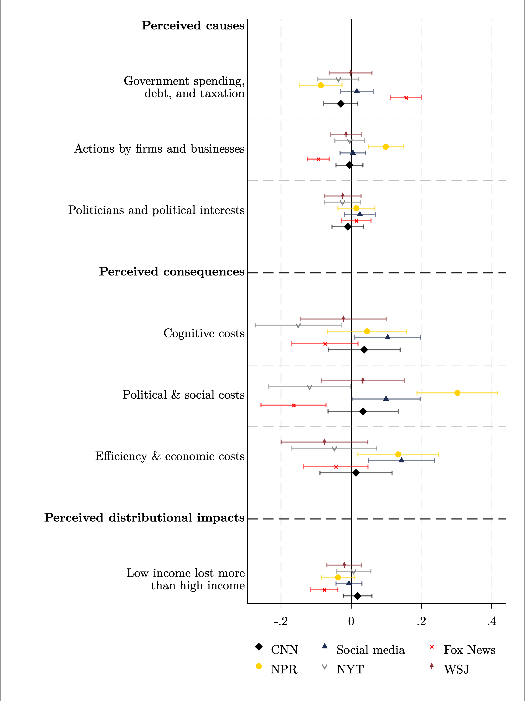

---

##### Download
+ [JME Version](https://www.sciencedirect.com/science/article/pii/S0304393224001053?via%3Dihub)
+ [Ungated WP](https://socialeconomicslab.org/research/working-papers/peoples-understanding-of-inflation/)
+ [Slides](slides_v3.pdf)

---

##### Abstract

This paper studies people’s understanding of inflation–their perceived causes, consequences, trade-offs–and the policies supported to mitigate its effects. We design a new, detailed on- line survey based on the rich existing literature in economics with two experimental components—a conjoint experiment and an information experiment—to examine how well public views align with established economic theories. Our key findings show that the major perceived causes of inflation include government actions, such as increased foreign aid and war-related expenditures, alongside rises in production costs attributed to recent events like the COVID-19 pandemic, oil price fluctuations, and supply chain disruptions. Respondents’ anticipate many negative consequences of inflation but the most noted one is the increased complexity and difficulty in household decision-making. Partisan differences emerge distinctly, with Republicans more likely to attribute inflation to government policies and foresee broader negative outcomes, whereas Democrats anticipate greater inequality effects. Inflation is perceived as an unambiguously negative phenomenon without any potential positive economic correlates. Notably, there is a widespread belief that managing inflation can be achieved with- out significant trade-offs, such as reducing economic activity or increasing unemployment. These perceptions are hard to move experimentally. In terms of policy responses, there is re- sistance to monetary tightening, consistent with the perceived absence of trade-offs and the belief that it is unnecessary to reduce economic activity to fight inflation. The widespread misconception that inflation rises following increases in interest rates even leads to support for rate cuts to reduce inflation. There is a clear preference for policies that are perceived to have other benefits, such as reducing government debt in progressive ways or increasing corporate taxes, and for support for vulnerable households, despite potential inflationary effects.

---

##### How your news source affects your understanding of inflation

