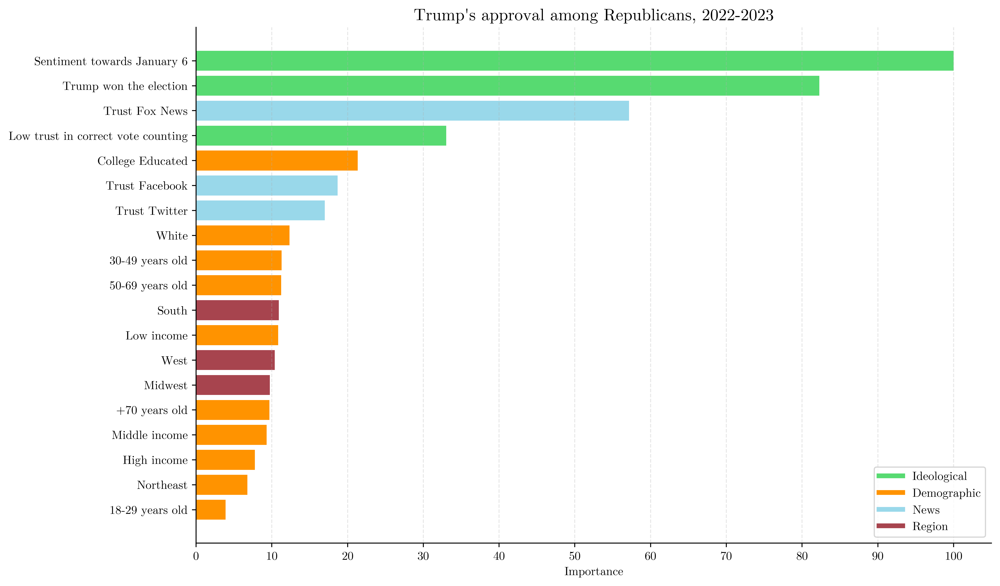

---

##### Download

+ [Paper](6jan_ab_public.pdf)
+ [Slides](slides_v3.pdf)

---

##### Abstract

This paper studies politicians' and voters’ reaction to the attack to Capitol Hill on January 6, 2021. Using data from Members of Congress tweets, I document that, relative to Democrats, Republican politicians i) tweet less after the event, ii) talk about the events more in the immediate aftermath, and iii) they do so using a much more positive tone, consistently with a damage-control strategy. Proxying voters’ reactions with positive engagement measures on Twitter, I find that capitol-related tweets from Republicans are much less popular than their Democratic counterpart. Finally, I leverage a large-scale nationally representative survey to investigate the immediate consequences of the event for public opinion. I find a sizeable decrease in Trump’s popularity among Republican voters. Moreover, this decrease is almost entirely concentrated among those believing the official election results to be correct. This suggests that beliefs about the nature of the attack, legitimate protest vs. attack to democracy, play a large role in explaining voters’ reaction to it.

---

##### Attitudes towards January 6 have a persistent impact

